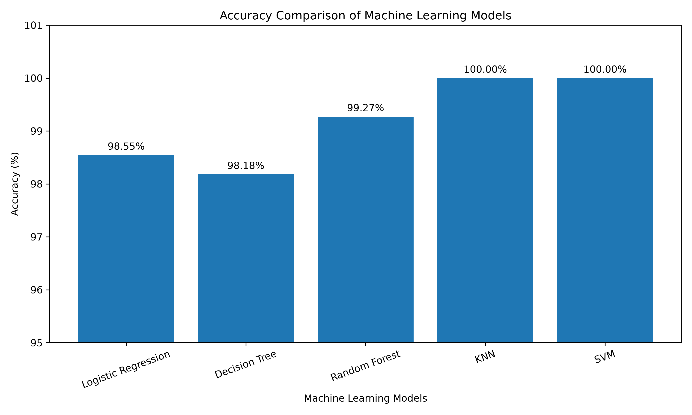
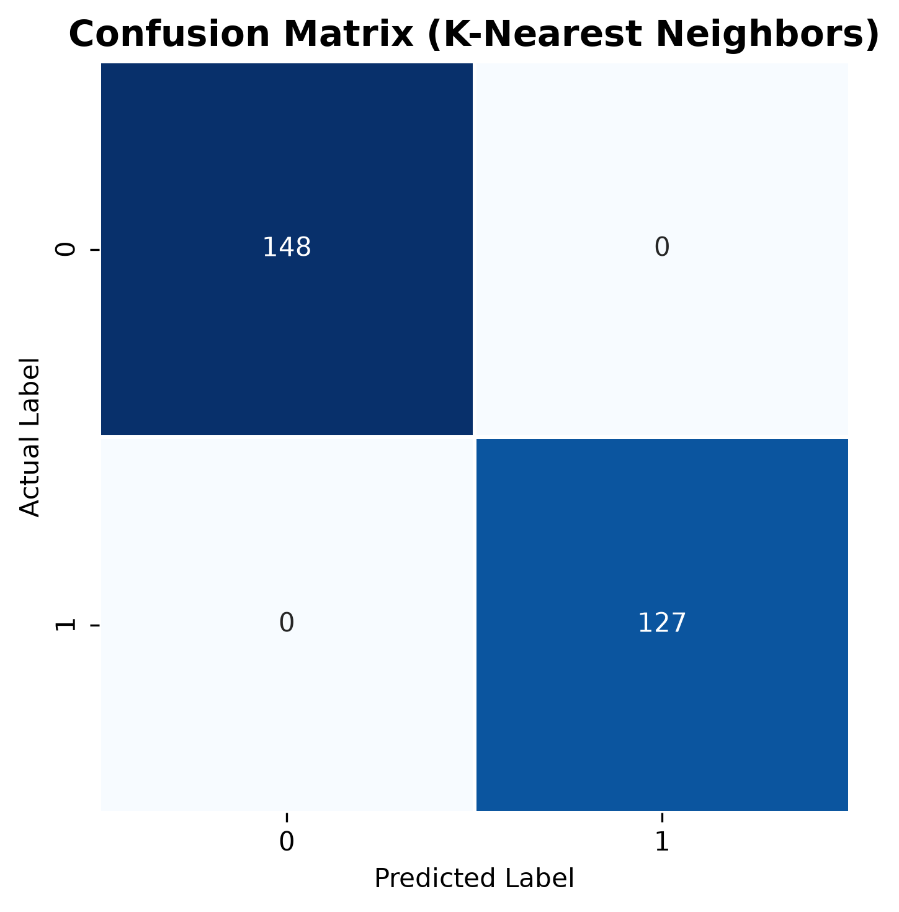
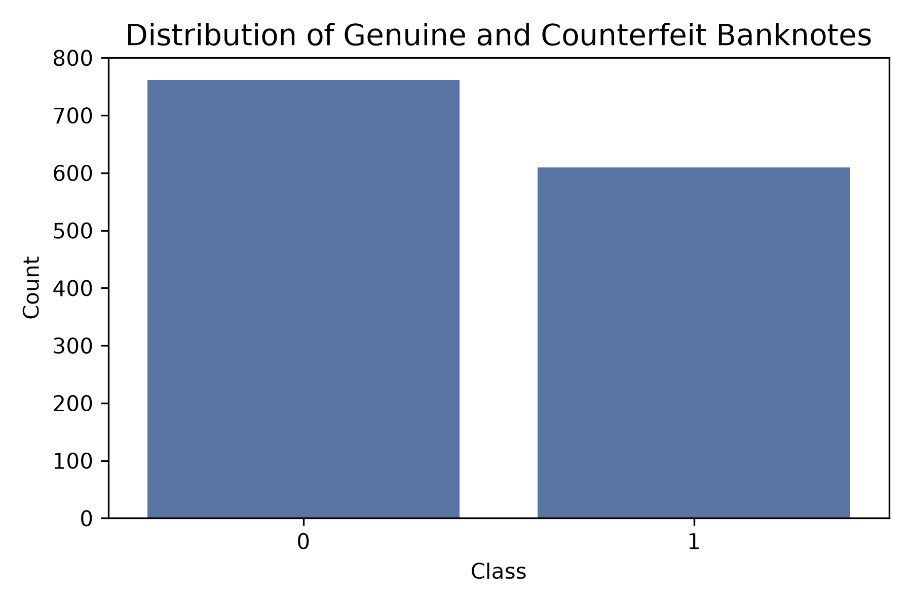
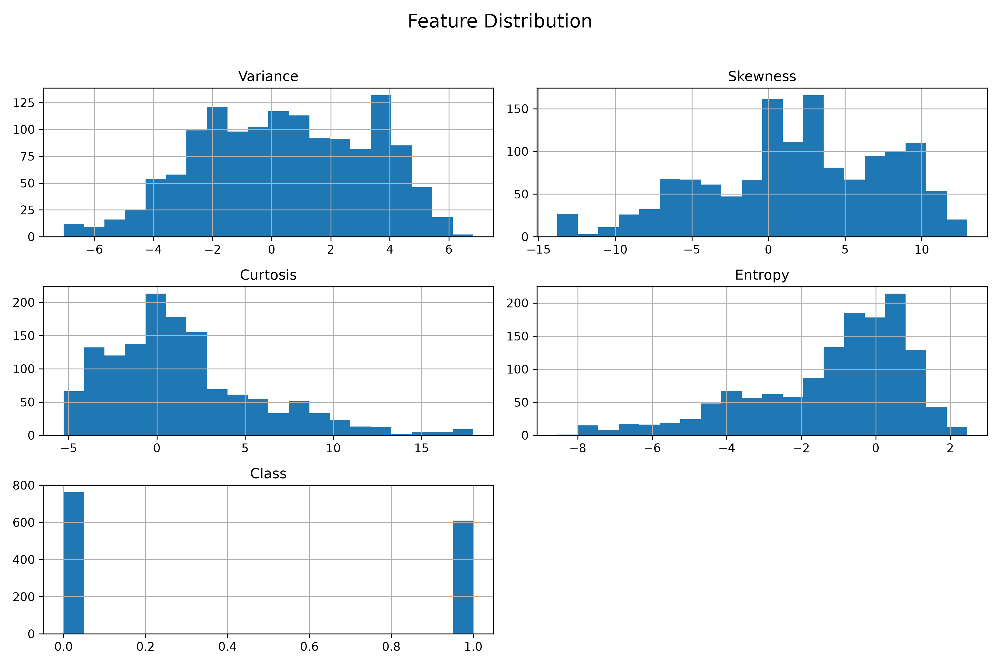
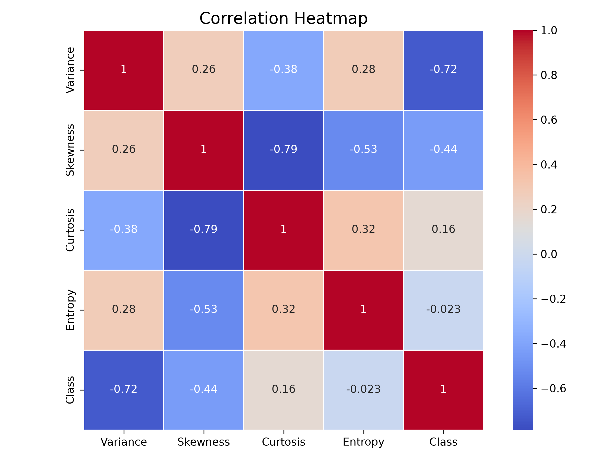

# 💵 Banknote Authentication using Machine Learning

<p align="center">


</p>

---

# 🚀 Live Dashboard

### 🌐 Try the Project

**https://banknote-appentication-machine-learning-k3wvea9f3kaztmxpmfg9vu.streamlit.app/**

---


# 📖 About the Project

This project uses **Machine Learning** to classify banknotes as **Genuine** or **Counterfeit** using statistical features extracted from banknote images.

Instead of training a single model, the project evaluates multiple machine learning algorithms and automatically selects the best-performing one.

The project also includes an interactive **Streamlit Dashboard** for exploring the complete workflow.

---

# ✨ Features

- 📊 Exploratory Data Analysis
- 📈 Interactive Dashboard
- 🤖 Multiple ML Algorithms
- 🏆 Automatic Best Model Selection
- 📉 Confusion Matrix
- 📋 Classification Report
- 💾 Saved Trained Model
- 🌐 Live Deployment using Streamlit

---

# 🧠 Machine Learning Pipeline

```text
Dataset
   │
   ▼
Data Analysis
   │
   ▼
Visualization
   │
   ▼
Train/Test Split
   │
   ▼
Train Multiple Models
   │
   ▼
Compare Performance
   │
   ▼
Select Best Model
   │
   ▼
Save Model
   │
   ▼
Deploy Dashboard
```

---

# 📊 Dataset

**Dataset:** Banknote Authentication Dataset

**Samples:** 1372

**Features:** 4

| Feature | Description |
|----------|-------------|
| Variance | Wavelet Variance |
| Skewness | Wavelet Skewness |
| Curtosis | Wavelet Curtosis |
| Entropy | Image Entropy |

Target

- **0 → Genuine**
- **1 → Counterfeit**

---

# 🤖 Models Compared

| Model | Accuracy |
|--------|----------|
| Logistic Regression | 98.55% |
| Decision Tree | 98.18% |
| Random Forest | 98.91% |
| KNN | **100%** |
| SVM | **100%** |

---

# 📈 Visualizations

## Dashboard

<p align="center">

</p>

---

## Accuracy Comparison

<p align="center">

</p>

---

## Confusion Matrix

<p align="center">

</p>

---

## Class Distribution

<p align="center">

</p>

---

## Feature Distribution

<p align="center">

</p>

---

## Correlation Heatmap

<p align="center">

</p>

---

# 📁 Project Structure

```text
Banknote-Authentication-ML
│
├── dataset/
├── models/
├── screenshots/
│
├── app.py
├── main.py
├── compare_models.py
├── train_model.py
├── requirements.txt
├── README.md
└── .gitignore
```

---

# ⚙️ Installation

Clone the repository

```bash
git clone https://github.com/Satvik-4web/banknote-authentication-machine-learning.git
```

Install dependencies

```bash
pip install -r requirements.txt
```

Run Dashboard

```bash
streamlit run app.py
```

---

# 🛠️ Tech Stack

- Python
- Streamlit
- Scikit-Learn
- Pandas
- NumPy
- Matplotlib
- Seaborn
- Plotly
- Joblib

---

# 📚 What I Learned

- Data Cleaning
- Exploratory Data Analysis
- Feature Engineering
- Model Evaluation
- Classification Metrics
- Model Comparison
- Streamlit Deployment
- Git & GitHub
- Machine Learning Workflow

---

# 🚀 Future Improvements

- Upload banknote images for prediction
- CNN-based classification
- Multi-currency support
- Real-time camera detection
- REST API integration

---

# 👨‍💻 Author

**Satvik**

⭐ If you liked this project, consider starring the repository.
